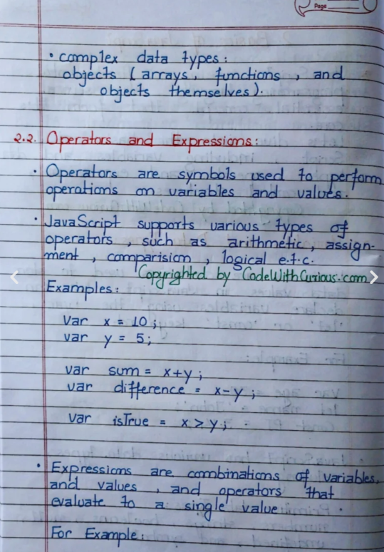
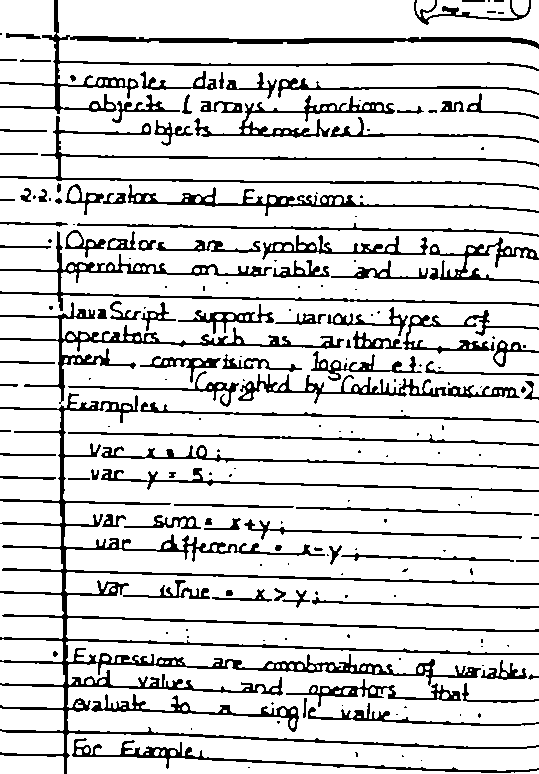

# Handwritten Notes Preprocessing System

## Overview
This project preprocesses handwritten notes and scanned documents to improve image quality before Optical Character Recognition (OCR). It converts PDFs into images and applies image enhancement techniques such as grayscale conversion and noise reduction to generate OCR-ready outputs.

## Features
* PDF to Image Conversion
* Grayscale Conversion
* Noise Reduction
* Image Enhancement
* Automatic File Management
* Batch Processing Support

## Technologies Used
* Python
* OpenCV
* NumPy
* PDF2Image
* Pillow

## Project Structure

```text
Project/
├── preprocessing.py
├── requirements.txt
├── README.md
├── .gitignore
└── image/
```


## Installation
```bash
pip install -r requirements.txt
```

## Run
```bash
python preprocessing.py
```

## Preprocessing Techniques
- PDF to Image Conversion
- Grayscale Conversion
- Noise Reduction
- Image Enhancement
- Image Saving and Organization
  
## Workflow
1. Upload PDF or Image
2. Convert PDF pages into images
3. Apply preprocessing techniques
4. Save enhanced images
5. Use processed images for OCR applications

## Sample Results
### Input Image


### Processed Image


## Applications
* Handwritten Notes Digitization
* Document Processing
* OCR Preparation
* Academic Record Digitization

## Future Enhancements
- OCR Integration using Tesseract
- Text Extraction from Processed Images
- Handwritten Notes Digitization
- Web-Based User Interface

## Author
Anisha Upadhyaya
Student | Python Developer | Computer Vision Enthusiast
